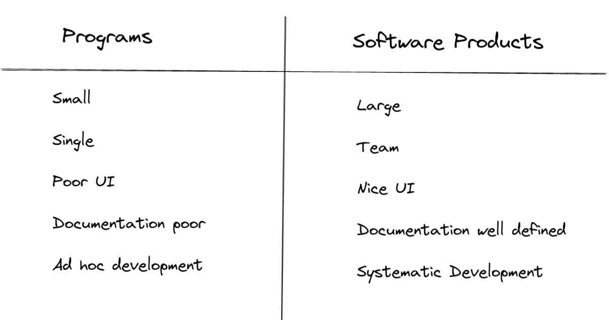

# INTRODUCTION 

## What is a software?

    The product that software professionals build and then support for long term.

    Software comprises of
        1) Instructions
        2) Data Structure
        3) Documentation

## Definition :

    Software Engineering is the application of a systematic , decipline and quantifiable approach to the development, operation and maintenance of software , i.e. the application of engineering to the software.

    Engineering approach to develop software.

## Software crisis:

     Causes :
        Software products are ,
        1) more expensive than hardware.
        2) difficult to alter, debug and enhance.
        3) use resources non-optimally.
        4) fail to meet user requirements.
        5) far from being reliable.
        6) Frequently crash.
        7) Delivered late.

    Solution:
        By spreading software engineering practices among the developers, coupled with further advancements to the software engineering discipline itself.

### Programs Vs Software Products:

### Phase contentment error:

    1) Understand Problem.
    2) Plan the solutions.
    3) Carry out the plan.
    4) Examine result(Tea=sting strategy defines).

# Software Development Life Cycle:

    A software development life cycle (SDLC) model describes the different activities that need to be carried out for the software to evolve in its life cycle.

# 1) Classical Waterfall Model:

    * Simple
    * Hard to put this model use in any non-trivial software development project.

    

    Feasibility and Integration and System Design -> Development Phase.

    Last Phase is Maintainence Phase.

    The activity that spans all phases of software development is called Project management.

    1) Feasibility Study:
        * To determine whether it would be financially and technically feasible to develop the software.

        * It involves collection of basic information, processing required, output data required as well as various constraints on the development

    2) Requirement analysis and specification: 
        * Goal is to collect all relevant information regarding software

        * Goal of requirement analysis is to weed out the incompletness and inconsistent in gathered requirements.

        * Then identified requirements are documened, this is called a Software Requirement Specification (SRS) document.

    3) Design:
        * To transform the requirement specified in SRS dociument into structure that is suitable for implementation in some programming language.

        * Software Architecture is derived from SRS document.

        1) Function / Procedural oriented design :
            * It is based on dataflow oriented design

            * Functional requirement specified in SRS document decomposed into subfunction and data-flow among these subfunctions is Analysed 

            * Then it represented Diagramatically.

        2) Object oriented Design:
            * Various objects that occur in problem domain and solution domain are first identified 

            * It is credited to have several benefits such as lower benefit time , effort and better maintainability of software.

    4) Coding and Testing:
        * To translate software design into source code and ensure individually each function is working correctly.

        * End product of this phase is set of program modules that have been individually unit tested.

        * Main objective is to determine the correct working of the individual modules.

    5) Integration and system testing:
        * Different modules are integrated in planned manner.

        * Integration of various modules are carried out variously no. of steps

        * Then full working system is obtained .

        * System testing is carried out on this fully working system.

    6) Maintenance:
        * Effort Spent during its operating phase is much more than required for developing software itself.

        * Types:
            1) Corrective Maintenance:
                To correct errors that were not discovered during product development phase.

            2) Perfective Maintenance:
                To improve performance of system.

            3) Adaptive Maintenance:
                Porting the software to work in a new environment.

    Shortcomings:
        1) No feedback paths.
        2) Difficult to accommodate change requests.
        3) Inefficient error corrections.
        4) No overlapping of phases.

# 2) Iterative Waterfall Model:

    

    * Feedback paths are introduced in this model.

    * It allow for correcting errors committed by a programmer during some phase, as and when these are detected in a later phase.

    * **The principle of detecting errors as close to their points of commitment as possible is known as phase containment of errors.**

    Shortcumings:
        1) Difficult to accomodate change requests.
        2) Incremental delivery not supported.
        3) Phase overlap.
        4) Error correction unduly expensive.
        5) Limited customer interaction.
        6) Heavy weight.
        7) No support to risk handling and code reuse.

# 3) V Model:

    

    * Get its name from visual apperance.

    * Model varification and Validation activities are carried out throughout development life cycle.

    * Suitable to use in process concern with development of safety-critical software that are required to have high reliability.

    * Left half Development phase and right half Validation Phase.

    *Advantages* :
        1) Must of testing activities are carried out in paralled with development activities.

        2) Quality of test cases are usually better..

        3) More efficient manpower utilization.

    *Disadvantages* :
        Being a derivative of the classical waterfall model, this model inherits most of the weaknesses of the waterfall model

# 4) Prototyping Model:

    * This model suggests building a working prototype of the system, before development of the actual software.

    * This model is the most appropriate for projects that suffer from technical and requirements risks. A constructed prototype helps overcome these risks.

    * Necessity of the prototyping model:

        1) For development of the graphical user interface (GUI) part of an application.
        2) Especially useful when the exact technical solutions are unclear to the development team.
        3) The prototyping model can be deployed when development of highly optimised and efficient software is required.

    

    1) Prototyping Development:
        This cycle of obtaining customer feedback and modifying the prototype continues till the customer approves the prototype.

    2) Iterative Development:
        Once the customer approves the prototype, the actual software is developed using the iterative waterfall approach.

    *Weaknesses* :

        * It can increase the cost of development of projects.

        * It not suffer for any significant risk.

        * Since the prototype is constructed only at the start of the project, the prototyping model is ineffective for risks identified later during the development cycle.

        * It not be appropriate for projects for which the risks can only be identified after the development is underway.

# 5) Increment Development Model:
        
    

    * Referred to as the successive versions model and sometimes as the incremental model

    

    * Advantages:
        1) Error Reduction.
        2) Incremental resource deployment.

# 6) Evolutionary Software Development Model :

    

    * Design a little, build a little, test a little, deploy a little.

    * The evolutionary model is well-suited to use in object-oriented software development projects.

    * Advantages:

        1) Effective elicitation of actual customer requirements.
        2) Easy handling change requests.

    * Disadvantages:

        1) Feature division into incremental parts can be non-trivial.

        2) Ad hoc design.

# 7) Rapid Application Development (RAD) Model:

    

    * Goals:
        * To decrease the time taken and the cost incurred to develop software systems.

        * To limit the costs of accommodating change requests.

        * To reduce the communication gap between the customer and the developers.

    * Incremental Process Model.

    * Cycle (60 - 90 days).

    * Application:
        * Customised software
        * Non-critical software
        * Highly constrained pro ject schedule
        * Large software

# 8) Spiral Model:

    

    * Each loop of the spiral is called a phase of the software process.

    * The exact number of phases through which the product is developed can be varied by the project manager depending upon the project risks.

    * A risk is essentially any adverse circumstance that might hamper the successful completion of a software project.

    * Disadvantages:
        * It appears complex model to follow.
        * It is risk driven and more complicated phase structure.
        * Not suitable for development of outsourced projects.

    * Advantages:
        For projects having many unknown risks that might show up as the development proceeds, the spiral model would be the most appropriate development model to follow.

        

# Software Project Management 

    The main goal of software project management is to enable a group of developers to work effectively towards the successful completion of a project.

    