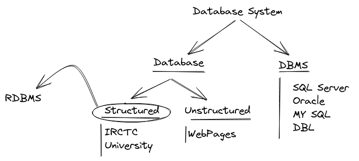

# Introduction

# Database system

## 1] Database

Collection of related data.

### a) Structured data --> RDBMS
Relation database management system(RDBMS).
It stored in table format by the relation in data.

### b) Unstructed data

## _________________________________

## 2] DBMS

